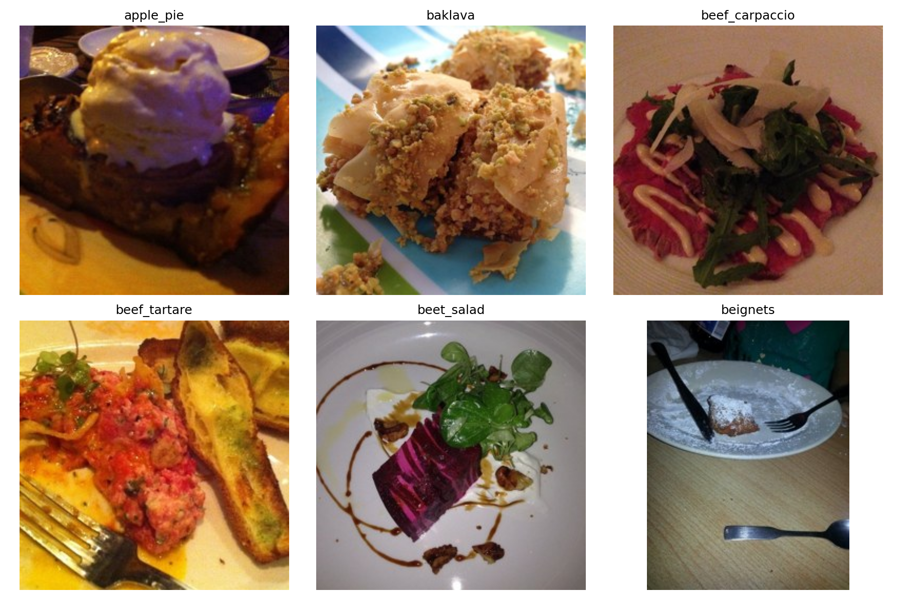

# Checkpoint — Classificação de Imagens + Deploy

Nome:
RM:
Turma:

## Objetivo

Você recebeu um conjunto de imagens derivado do Food-101, já separado em treino, validação e teste. Sua tarefa é construir um classificador usando uma **CNN** ou **ViT** com **transfer learning** e/ou **fine-tuning**, avaliar o modelo e disponibilizá-lo por meio de uma aplicação **FastAPI**.

O notebook fornecido contém **somente o carregamento do dataset**. Todo o restante da solução deve ser desenvolvido por você.

## Dataset



O checkpoint utiliza 6 classes:

- `apple_pie`
- `baklava`
- `beef_carpaccio`
- `beef_tartare`
- `beet_salad`
- `beignets`

Estrutura esperada após executar a primeira célula do notebook:

```text
food101_dataset/
├── train/
├── val/
└── test/
```

Cada pasta contém uma subpasta por classe.

## Parte A — Modelo

No notebook, desenvolva uma solução que:

1. prepare os dados para treinamento;
2. utilize **um modelo pré-treinado** adequado para classificação de imagens. A escolha da arquitetura e da estratégia de treinamento faz parte da avaliação;
3. adapte o modelo para o problema;
4. aplique transfer learning ou fine-tuning;
5. treine o modelo;
6. avalie o resultado usando os conjuntos fornecidos;
7. apresente pelo menos duas métricas quantitativa no conjunto de teste estudadas em aula;
8. apresente uma matriz de confusão e interprete o resultado;
9. salve os artefatos necessários para utilizar o modelo fora do notebook.


> Faça o treinamento no google colab com GPU ativa.

## Parte B — Aplicação

A pasta `api_base/` contém uma aplicação FastAPI incompleta baseada na estrutura usada em aula.

Adapte a aplicação para:

1. carregar os artefatos produzidos no notebook;
2. receber uma imagem pelo endpoint `POST /predict`;
3. aplicar o mesmo pré-processamento esperado pelo modelo;
4. executar a inferência;
5. retornar a classe prevista e sua probabilidade;
6. retornar também as três classes mais prováveis (`top3`);
7. demonstrar a aplicação funcionando com uma imagem que não pertence ao conjunto de treino.

A rota `/health` já existe e pode ser usada para verificar se a aplicação iniciou corretamente.


## Entrega (NOTA)

Entrega é uma demonstração em aula:

- O notebook deve estar **executado**, com métricas e resultados visíveis. (até 5 pontos)
- A API deve estar rodando localmente e responder ao endpoint `/predict`. (até 5 pontos)


## Uso de IA

Ferramentas de IA generativa podem ser utilizadas durante a prova. Você é responsável por:

- validar o código gerado;
- adaptar a solução ao dataset e ao modelo escolhido;
- compreender as decisões presentes na sua implementação;
- garantir que treinamento, artefatos e API sejam compatíveis entre si.
